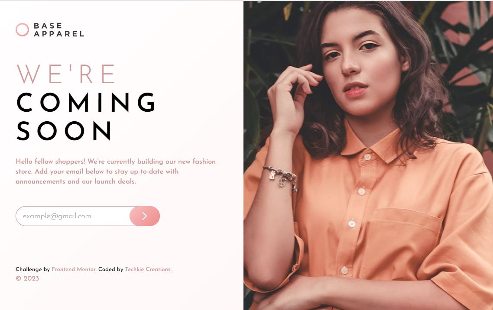

# Frontend Mentor - Base Apparel coming soon page solution

This is a solution to the [Base Apparel coming soon page challenge on Frontend Mentor](https://www.frontendmentor.io/challenges/base-apparel-coming-soon-page-5d46b47f8db8a7063f9331a0). Frontend Mentor challenges help you improve your coding skills by building realistic projects. 

## Table of contents

- [Overview](#overview)
  - [The challenge](#the-challenge)
  - [Screenshot](#screenshot)
  - [Links](#links)
- [My process](#my-process)
  - [Built with](#built-with)
  - [Continued development](#continued-development)
- [Author](#author)

## Overview

### The challenge

Users should be able to:

- View the optimal layout for the site depending on their device's screen size
- See hover states for all interactive elements on the page
- Receive an error message when the `form` is submitted if:
  - The `input` field is empty
  - The email address is not formatted correctly

### Screenshot

### Links

- Solution URL: [You are already here](https://github.com/Techkie-Creations/base-apparel-frontendmentor)
- Live Site URL: [Base Apparel Frontend Mentor](https://techkie-creations.github.io/base-apparel-frontendmentor)

## My process

### Built with

- Semantic HTML5 markup
- CSS custom properties
- Flexbox
- Desktop-first workflow
- [React](https://reactjs.org/) - JS library
- [Bootstrap Components](https://getbootstrap.com/) - For styles

### Continued development

Still planning on actually sending live emails when a user signs up -- if interested check again in the near future!

## Author

#### Techkie Creations

- Frontend Mentor - [@Techkie-Creations](https://www.frontendmentor.io/profile/Techkie-Creations)
- Codepen - [@Techkie-Creations](https://codepen.io/Tech--Guy)